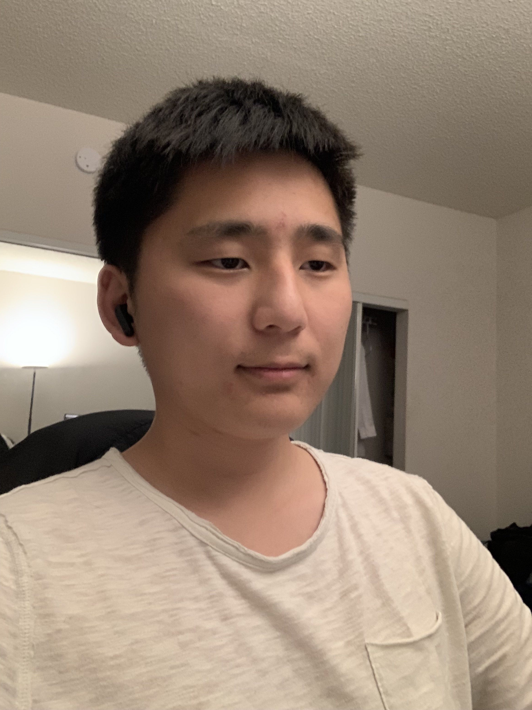

# User Page

**Name:** *Yifei Du*

### Who Am I:
> I'm a 4th year student in ERC, Double majoring in Cognitive Science and Mathmatics

The best programming language I know is `Python`

[This](https://github.com/Efaythegreat) is my github page

[Here](README.md) is the readme page for this repo

## Here's a list of Programming Languages I know:
- Python
- C++
- C
- HTML
- CSS
- JavaScript
- Java

## Here's a list of languages I know:
1. Cantonese
2. Mandarin
3. English

## Here's a Task List for my HW for this class
- [x] Lecture 3 Prep Content
- [x] Lab - Week 1 

[Top of Page](#user-page)